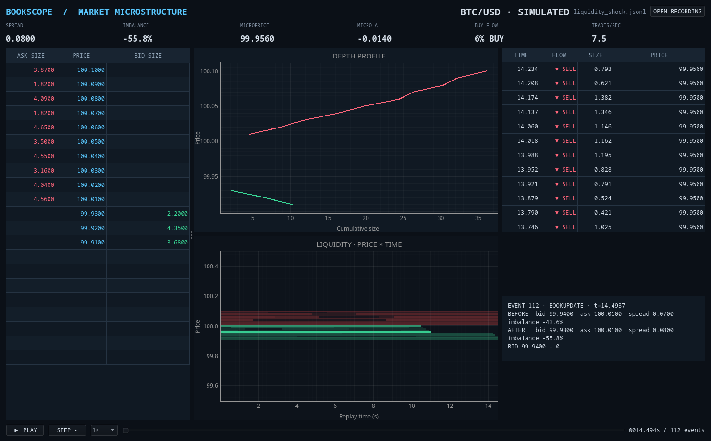

# Bookscope

**Version 0.0.1** · A replay-first market microstructure workstation.

Bookscope reconstructs a limit order book from timestamped events and makes
the mechanics around a price move visible: resting depth, executions, spread,
liquidity imbalance, and short-term flow. Its deterministic replay engine is
the same state machine a future exchange adapter can feed; the first release
uses a self-contained synthetic recording so the demo works offline.



## Run the demo

Python 3.10 or newer is required.

```sh
git clone https://github.com/Guido-DeSolo/Bookscope.git
cd Bookscope
python3 -m venv .venv
. .venv/bin/activate
python -m pip install -e .
bookscope
```

The app opens `data/liquidity_shock.jsonl` by default. Click **Play** to watch
the bid wall disappear, sell flow accelerate, and the spread widen. Use the
file button to load another JSONL recording.

```sh
bookscope data/liquidity_shock.jsonl
python -m bookscope --version
bookscope --help
```

## Workstation

- **Price ladder** — the ten best bid and ask levels, with size on both sides.
- **Depth profile** — cumulative visible liquidity from the best quote outward.
- **Liquidity heatmap** — signed resting size over price and replay time; green
  is bid liquidity and red is ask liquidity.
- **Time and sales** — recent executions with explicit buy/sell markers, size,
  price, and event time.
- **Metrics strip** — spread, top-ten depth imbalance, microprice, microprice
  displacement from midpoint, rolling buy-volume share, and trade intensity.
- **Replay controls** — play/pause, single-event step, 1×/2×/10×/100× speed,
  and event-by-event seeking.
- **Event inspector** — selected event plus before/after best quotes, spread,
  and imbalance.
- **Recording picker** — open any normalized JSONL file.

There are no broker connections, accounts, orders, news feeds, technical
indicators, or network requirements in this release.

## Recording format

One JSON object per line. `t` is seconds from an arbitrary start and events
must be ordered by time. A metadata line is optional. A snapshot establishes
the initial state; book updates replace one level and size zero removes it.
Trades are tape events and do not mutate the book: a feed should report its
resulting book changes as separate updates.

```jsonl
{"type":"meta","symbol":"BTC/USD","tick_size":0.01}
{"t":0,"type":"snapshot","bids":[[100.00,3.2]],"asks":[[100.01,1.8]]}
{"t":0.0021,"type":"book","side":"bid","price":100.00,"size":4.1}
{"t":0.0031,"type":"trade","side":"buy","price":100.01,"size":0.4}
{"t":0.0040,"type":"book","side":"ask","price":100.01,"size":0}
```

Generate a new deterministic sample:

```sh
python -m bookscope.generate data/my_session.jsonl
bookscope data/my_session.jsonl
```

Supported events are `snapshot`, `book`, and `trade`. Book sides are `bid` or
`ask`; trade aggressors are `buy` or `sell`. Prices and sizes are parsed as
decimals, and malformed, negative-time, and out-of-order recordings fail with
a line-numbered error.

## Engine and validation

The engine maintains descending bids and ascending asks and derives best bid,
best ask, midpoint, spread, top-ten bid/ask depth, normalized imbalance, and
size-weighted microprice. Trades feed a rolling aggression and intensity
window. Replay seeks rebuild state from the start, so a seek and a sequential
run produce identical results. The UI samples the latest state at about 30
frames per second while processing every event in order.

Run the engine checks without installing the desktop dependencies:

```sh
PYTHONPATH=src python -m unittest discover -s tests -v
```

## Project layout

```text
src/bookscope/models.py       event types and JSON normalization
src/bookscope/engine/book.py  order book and derived metrics
src/bookscope/engine/replay.py deterministic event/replay state
src/bookscope/engine/recording.py JSONL validation and loading
src/bookscope/ui/             PySide6/PyQtGraph workstation
data/liquidity_shock.jsonl    offline demo recording
tests/                        order book, replay, and loader checks
```

## License

MIT.
